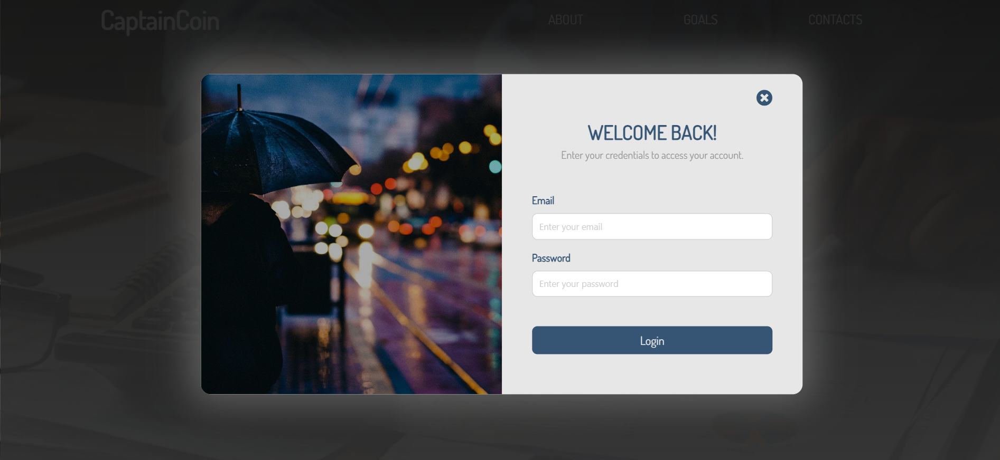

# CaptainCoin (⚠️`In development!`⚠️)
`CaptainCoin` is an app which was primarily designed to serve as budget calculator. The idea was to allow user to register, sign in and then keep track of all of their expenses. The users would be able to input expenses and after that see the charts and statistics of their money spendings.
  
The goal is to one day **redesign this page from scratch and fix all of its layout and functionality bugs.**

<hr>

## Showcase 




<hr>

## Tech and tools used
<div>


</div>
<div>


</div>

<hr>

## Project setup
```
npm install
```

### Compiles and hot-reloads for development
```
npm run serve
```

### Compiles and minifies for production
```
npm run build
```

### Lints and fixes files
```
npm run lint
```
